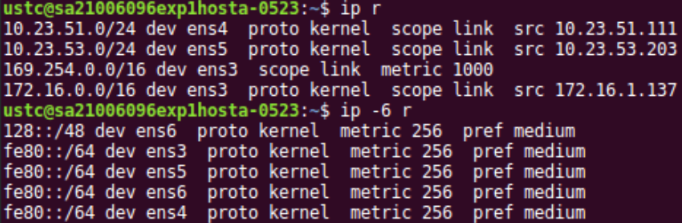

## 实验目标

1. 了解 ARP 协议的原理。
2. 了解 IP 协议并学习基础的 IP 协议配置。
3. 了解 TCP/IP 连接过程。

## 实验原理

### 常用命令

- `ip`{.sh} 查看 IP, ARP 的相关信息
  - `ip n`{.sh} 查看邻居的 ARP 表项。
  - `ip n f all`  清除邻居的 ARP 表项。
  - `ip a`{.sh} 查看网络接口的 MAC、IP 等信息。
- `ss`{.sh} 查看 TCP, UDP 的相关信息
- `ping`{.sh} 发送 ICMP 请求。
  - `ping -6`{.sh} 发送 IPv6 的 ICMP 请求。
- `nmap`{.sh} 嗅探主机打开的端口。
- `telnet`{.sh} 通过 TELNET 协议远程登录计算机。

### ARP 协议

ARP 协议是地址解析的通用协议（Reverse Address Resolution Protocol），其提供了网
络层地址（IP 地址）到物理地址（mac 地址）之间的动态映射，在实际通信中，物理网络
使用硬件地址进行报文传输。IP 报文在封装为数据链路层帧进行传送时，就有必要把 IP
地址转换为对应的硬件地址，ARP 正是动态地完成这一功能的。通过 `arp -n`{.sh} 或者
`ip neigh show`{.sh} 可以查看 ARP 缓存表的内容。

### IP 协议

IP 协议（Internet Protocol，互联网协议）中的 IP 地址，保证了联网设备的唯一性，
实现了网络通信的面向无连接和不可靠的传输功能。 IP 版本有 IPv4 和 IPv6，通过
`route -n`{.sh} 和 `route --inet6`{.sh} 命令可查看相应的 IP 路由配置。IPv4 中规
定 IP 地址长度为 32，最大地址个数为 $2^{32}$ ；而 IPv6 中 IP 地址的长度为 128，
即最大地址个数为 $2^{128}$ , 与 IPv4 相比，IPv6 有以下优势:

- IPv6 具有更大的地址空间
- IPv6 使用更小的路由表
- IPv6 增加了增强的组播支持以及对流的控制
- IPv6 加入了对自动配置的支持
- 更好的头部格式

### TCP/IP

TCP/IP 指传输控制协议/网际协议 (Transmission Control Protocol / Internet
Protocol), 其提供面向连接的可靠传输服务，工作在 OSI 的传输层，TCP 工作过程主要
是建立连接，然后从应用层程序接收数据并进行传输，采用虚电路的方式进行工作，发送
数据前需要 在发送接收端建立连接，数据发送后发送方等待接收方做出确认接收的应答，
否则发送方任务数据丢失并重新发送该数据。

## 实验结果

### 理解 ARP 协议

#### 1

在 HostA 和 HostB 中分别打开一个终端用于本实验。

---

如图 [1-1](#fig:1-1) 按默认快捷键 `Ctrl-Alt-T` 打开 `gnome-terminal`{.sh} 。按
`F11` 全屏。

{#fig:1-1}

#### 2

在 HostA 和 HostB 中分别执行命令 `ifconfig ens5`{.sh}，查看并记录它们各自的
IPv4 地址。执行命令 `ifconfig ens6`{.sh} 查看 IPv6 地址 (global 和 link 两种)
以及以太网接口的物理地址。

---

{#fig:1-2a}

{#fig:1-2b}

见图 [1-2a](#fig:1-2a) 和图 [1-2b](#fig:1-2b) 。`ip a s`{.sh}
（`ip address show`{.sh} 的省略）也可以查看 IP 地址。（而且敲的字符还少些）

#### 3

在 HostA 中执行命令 `arp -n`{.sh} 或 `ip neigh show`{.sh} 查看并记录本机 ARP 缓
存表的内容。

---

见图 [1-3](#fig:1-3) 。`ip neigh show`{.sh} 可以省略为 `ip n`。

{#fig:1-3}

#### 4

在 HostA 中执行命令 `ping -c 1`{.sh} HostB 的 IPv4 地址向 HostB 发送 ICMP 请求
报文。收到 ICMP 响应后再次执行命令 `arp -n`{.sh} 或 `ip neigh show`{.sh} 查看
HostA 的 ARP 缓存表的内容。

---

见图 [1-4](#fig:1-4) 。 `ping -c 1`{.sh} 的一个空格可以省略为 `ping -c1`{.sh}。

{#fig:1-4}

#### 5

在 HostA 的 ARP 缓存表里面可获得 HostB 的 MAC 地址，记录下来，检查与 HostB 上
`ifconfig ens5`{.sh} 命令的执行结果是否一致。

---

由图 [1-4](#fig:1-4) 和图 [1-2b](#fig:1-2b) 可知与 HostB 上执行结果一致。

#### 6

在 HostA 中执行命令 `ping6 -c 1 128::1`{.sh} ，收到 ICMP 响应后继续执行命令
`ip neigh show`{.sh} 查看 HostA 的 ARP 缓存表，记录结果。简要解释为何无法看到对
应于地址 128::1 的 ARP 表项而只能得到网关的某网卡的 MAC 地址。提示：思考网段(链
路)、广播域的概念。

---

见图 [1-6](#fig:1-6) 。

{#fig:1-6}

广播域：连接到同一个或互相链接以太网中继器或者交换机的任意电脑属于同一个广播域。
而路由器和其他的网络层设备会在广播域间形成隔离。 只有当 IPv6 地址为 128::1 的主
机在 HostA 广播域内时，才能得到其 ARP 表项。

### 学习 IP 协议基本配置

（此步骤仅使用虚拟机 HostA）

#### 1

分别用命令 `route -n`{.sh} 和命令 `route --inet6`{.sh} 查看本机的 IPv4 和 IPv6
路由配置，记录所在子网的子网掩码/前缀长度，并于前面 `ifconfig`{.sh} 的结果作比
较。

---

{#fig:2-1}

见图 [2-1](#fig:2-1) 。 `ip r`{.sh} 和 `ip -6 r`{.sh} 也可以显示 IPv4 和 IPv6
路由配置，但显示结果有差别，比如 `route -n`{.sh} 显示子网掩码不显示前缀长度，
`ip r` 显示前缀长度不显示子网掩码。

比较前面的结果后可以发现路由配置和 IP 地址是存在对应关系的。

#### 2

执行以下两个命令分别查看系统内核的 IPv4 和 IPv6 的 FORWARD 值，记录下来。简单解
释这个值的含义以及为何这个值是这样设定的。提示：思考主机与路由器的区别。

- 命令 1：`cat /proc/sys/net/ipv4/ip_forward`{.sh}
- 命令 2：`cat /proc/sys/net/ipv6/conf/all/forwarding`{.sh}

---

{#fig:2-2}

如图 [2-2](#fig:2-2) IP 转发指从一个网络接口向同一设备上的另一个网络接口发送网
络包。当系统充当将 IP 数据包从一个网络传输到另一个网络的路由器时，应该启用它。
FORWARD 值默认值为 0， 意味着没有 IP 转发，因为运行没有其他组件的单台主机的普通
用户通常不需要。

### TCP 端口探测

（此步骤使用虚拟机 HostA 和服务器 S）

#### 1

在 S 的终端 1 中执行 `nc -l 1958`{.sh} 侦听 1958 端口。

---

见图 [3-1](#fig:3-1)。

{#fig:3-1}

#### 2

在 HostA 的终端 1 执行 `nc`{.sh} S 的 IPv4 地址 1958 。

---

见图 [3-2](#fig:3-2)。

{#fig:3-2}

#### 3

在 HostA 终端 2 中执行命令 `netstat -aunt`{.sh} 来观察自己主机上的所有 TCP 与
UDP 连接状况，将输出的信息记录下来。请在上述记录的结果中找到对应于上述连接的那
条记录并解释这条记录的含义。

---

{#fig:3-3}

见图 [3-3](#fig:3-3)。

对应于上述连接的那条记录是 State 为 ESTAB 的记录。含义是从本机建立一条到路由器
的 TCP 连接。

`ss -aunt`{.sh} 也可以查看本机的连接状况。

#### 4

执行命令 `nc`{.sh} S 的 IPv4 地址 100，记录命令执行结果。同样使用
`netstat -aunt`{.sh} 来查看本机的连接状况，请判断这次 `telnet`{.sh} 连接是否成
功建立并简单说明原因。

---

{#fig:3-4}

见图 [3-4](#fig:3-4)。命令返回结果不为 0 ，执行失败。从 `netstat -aunt`{.sh} 的
结果也可以看到没有任何目的端口为 100 的 TCP 连接建立。

`telnet` 连接会失败，因为 `telnet` 对应的 23 端口并未被开启。可以用 `nmap` 嗅探
路由器开启的端口。或者从图 [3-1](#fig:3-1) 可以看出。

## 思考题

### 1

现在有一个网段的 IP 地址和子网掩码分别为 202.38.75.0/255.255.255.192，请计算该
网段中一共有多少个全局 IPv4 地址可供主机使用，或者说这个网络中有多少真正可分配
的 IP 地址？

---

$$192 = 11000000_2$$

除去网络地址 202.38.75.0 和广播地址 202.38.75.255 以及路由器的 IP 地址
（默认是 202.38.75.1 ），至少有 $2^6 - 3 = 61$ 个 IP 地址可分配。

### 2

实验中执行 `ifconfig ens3`{.sh} 查看接口的配置信息时可以观察到一个重要的参数
MTU，请问这个值是多少？查询资料说明 MTU 参数的用途。

---

MTU 是 1500。`ip a`{.sh} 也可以观察到 MTU。

最大传输单元 (Maximum Transmission Unit) 是数据链路层的概念。用来通知对方所能接
受数据服务单元的最大尺寸，说明发送方能够接受的有效载荷大小一般以字节为单位。如
果MTU过大，在碰到路由器时会被拒绝转发，因为它不能处理过大的包。如果太小，因为协
议一定要在包(或帧)上加上包头，那实际传送的数据量就会过小，这样也划不来。大部分
操作系统会提供给用户一个默认值，该值一般对用户是比较合适的。

### 3

IPv6 地址长度是 IPv4 地址长度的 4 倍，不过在今后的纯 IPv6 网络环境中路由器的路
由表的规模反而有望减小，请简单解释这是为什么？

---

因为：

- IPv6 采用 CIDR 后可以通过细粒度的地址分配来提高地址利用率，通过前缀汇聚减少路
由开销，提高路由性能。
- IPv6 使用固定格式扩展头部，简化了报文头部格式。

### 4

一条 TCP 连接需要哪几个参数标识？

---

源地址、源端口、目的地址、目的端口。

## 实验收获

通过本实验我了解了关于 ARP、IP、TCP 协议的基本知识，并在 Linux 系统上亲手实践了
相关操作。我本人亦使用 Linux 电脑，所以这些指令对我以后也派的上用场。非常感谢。

在实验过程中能实现相同功能的指令我尽量使用能输入最少字符个数的版本（例如
`ip`{.sh} 和 `ss`{.sh} ）。

最后建议提供 ssh 端口， novnc 在网页浏览器里显示远程桌面，网页浏览器会劫持远程
计算机的快捷键，比如网页浏览器里 `Ctrl-W` 是关闭当前标签页的快捷键，但在 `bash`
却是删除前一个单词的快捷键。有时一个指令最后一个单词敲错了习惯性地按 `Ctrl-W`
结果把当前标签页关了让人很是恼火。
