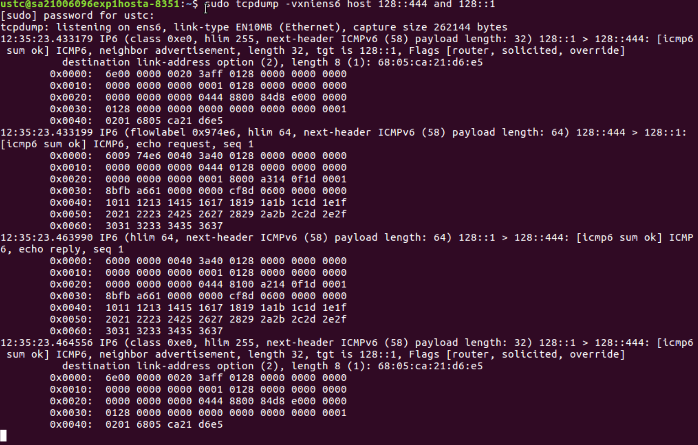

## 实验原理

- `ip a s ens5`{.sh} 查看网卡信息
- `tcpdump -iens5 host hostA and hostB`{.sh} 在指定的网卡上抓指定主机的包
- `ip t a sit1 mode sit local hostA remote hostB dev ens4` 在指定的网卡上添加一
个从指定主机到指定主机的指定模式的隧道
- `ip l s sit1 u` 连接指定隧道
- `ip l` 显示当前已连接的网卡
- `ip a a <IP> <addr/prefix> dev ens5` 设置网卡的 IP 地址
- `ip t` 查看隧道状态

## 实验结果

### 基本操作

#### 1

查看并记录 HostA 和 S 的 IPv6 地址，命令 `ifconfig ens6`{.sh} 。

---

{#fig:1-1a}

{#fig:1-1b}

如图 [1-1a](#fig:1-1a) 和 [1-1a](#fig:1-1a) ，在 global 一行可以看到二者的 IPv6
地址。

#### 2 IPv6 连接

HostA 的终端 1 中执行 `tcpdump -vxn host`{.sh} HostA 的 IPv6(scope:global)地址
`and 128::1 -i ens6`{.sh}。

HostA 的终端 2 中执行 `ping6 -c 1 128::1`{.sh}。

此步骤需要记录终端 1 中抓到的 2 个报文数据，表明哪个是请求报文，哪个是回复报文。
根据 IPv6 协议报文格式分析上述 tcpdump 抓包结果，要求画出 IPv6 以及 ICMPv6 的基
本报头结构并将各个字段分别填入其中 (例如 IP 协议版本、源地址和目的地址、源端口
和目的端口、报文含义等)。对这个报文的含义加以解释。

---

{#fig:1-2a}

{#fig:1-2b}

如图 [1-2a](#fig:1-2a) ，第 2 条是请求报文，第 3 条是回复报文。该请求报文是从
128::444 发往 128::1 的长度为 64 ，下一报文为 58 的报文。该回复报文是从 128::1
发往 128::444 的长度为 64 ，下一报文为 58 的报文。

- 请求报文
  - IPv6
    - 版本：6
    - 业务流类别：00
    - 流标签：974e6
    - 净荷长度：0040
    - 下一报文：3a
    - 跳极限：40
    - 源 IP 地址：0128 0000 0000 0000 0000 0000 0000 0444
    - 目的 IP 地址：0128 0000 0000 0000 0000 0000 0000 0001
  - ICMPv6
    - 类型：80
    - 代码：00
    - 校验和：a314
    - 标识符：0f1d
    - 序列号：0001
    - 数据：8bfb a661 0000 0000 cf8d 0600 0000 0000
    1011 1213 1415 1617 1819 1a1b 1c1d 1e1f
    2021 2223 2425 2627 2829 2a2b 2c2d 2e2f
    3031 3233 3435 3637
- 回复报文
  - IPv6
    - 版本：6
    - 业务流类别：00
    - 流标签：00000
    - 净荷长度：0040
    - 下一报文：3a
    - 跳极限：40
    - 源 IP 地址：0128 0000 0000 0000 0000 0000 0000 0001
    - 目的 IP 地址：0128 0000 0000 0000 0000 0000 0000 0444
  - ICMPv6
    - 类型：81
    - 代码：00
    - 校验和：a214
    - 标识符：0f1d
    - 序列号：0001
    - 数据：8bfb a661 0000 0000 cf8d 0600 0000 0000
    1011 1213 1415 1617 1819 1a1b 1c1d 1e1f
    2021 2223 2425 2627 2829 2a2b 2c2d 2e2f
    3031 3233 3435 3637

#### 3 路由器公告报文

路由器公告报文的目的地址为 IPv6 组播地址中的“全节点地址”，它的地址是 FF02::1，
可用 `tcpdump`{.sh} 侦听路由器公告报文。 HostA 中另开一个终端 3 用于侦听路由器
公告报文，命令为：`tcpdump –vxn host ff02::1 -i ens5`{.sh}。

查阅资料，分析路由器通告报文通告了哪些信息并简单解释网络中的其它主机将会如何使
用这些信息？

---

{#fig:1-3a}

{#fig:1-3b}

如图 [1-3a](#fig:1-3a) 和 [1-3b](#fig:1-3b)。路由器通告是路由器主动发送的报文，
目的是告诉链路中的主机自己路由器的身份。路由器通告的信息有：

- 一系列子网前缀，与前缀相关联的标志用来制定特定前缀的预定用法。主机使用通告的
“在链路 (on-link) ”前缀来创建和维护一个列表，该列表用于确定包的目标是在链路上还
是在路由器外部。即使目标没有包含在所通告的任何“在链路 (on-link) ”前缀中，目标也
可以位于链路上。在这种情况下，路由器可以发送重定向消息。
- 重定向功能通告发送者目标是相邻节点。路由器通告和每前缀标志使路由器能够通告主
机如何执行无状态地址自动配置。
- 主机应当在外发包中使用的 Internet 参数，如跃点限制。
- 链路参数，如链路 MTU。此功能允许对临界参数进行集中管理。这些参数可以针对路由
器设置，它们可自动传播到所连接的全部主机。节点可通过向多点传送组发送相邻节点请
求以要求目标节点返回其链路层地址来完成地址解析。多点传送相邻节点请求消息会发送
到目标地址中请求节点的多点传送地址。目标会在单点传送相邻节点通告消息中返回其链
路层地址。对于启动器和目标来说，一个包请求/响应对就足以解析对方的链路层地址。启
动器的相邻节点请求中包括其链路层地址。

网络中的其他主机会利用这些消息：

- 解析地址
- 与路由器连接
- 通过路由器与互联网进行连接

#### 4 地址解析

地址解析的目的是通过对端的 IP 获取对端的 MAC 地址。由于地址解析过程会在数据发送
前自动进行，因此需要先用 `tcpdump`{.sh} 侦听，再 `ping`{.sh} 对端，即可观察到
NS 和 NA 报文。

HostA 的终端 1 执行命令 `tcpdump -vxn host`{.sh} HostA 的 IPv6(scope:global)地址

HostA 的终端 2 执行命令 `ping6 -c 1`{.sh} HostB 的 IPv6(scope:global） 地址

记录 HostA 的终端 1 中观察到的前两个报文，即邻居请求 (NS) 和邻居通告 (NA) 报文。
根据抓取到的报文数据说明邻居请求及邻居公告报文通告了哪些信息，这些信息有什么作
用？

---

{#fig:1-4a}

{#fig:1-4b}

如图 [1-4a](#fig:1-4a) 和 [1-4b](#fig:1-4b) 。

- NS报文
  - 源 IP 地址：128::444
  - 目的 IP 地址：128::3c
  - 在地址解析中的作用类似于 IPv4 中的 ARP 请求报文。
- NA报文
  - 源 IP 地址：128::3c
  - 目的 IP 地址：128::444
  - 在地址解析中的作用类似于 IPv4 中的 ARP 应答报文。

1. Host A 在向 Host B 发送报文之前它必须要解析出 Host B 的 MAC 地址，所以首先
   Host A 会发送一个 NS 报文，其中源地址为 Host A 的 IPv6 地址，目的地址为 Host
   B 的被请求节点组播地址，需要解析的目标 IP 为 Host B 的 IPv6 地址，这就表示
   Host A 想要知道 Host B 的 MAC 地址。同时在 NS 报文中还携带了 Host A 的 MAC
   地址。
2. 当 Host B 接收到了 NS 报文之后，就会回应 NA 报文，其目的地址为 Host A 的
   IPv6 地址（使用 NS 报文中的 Host A 的 MAC 地址进行单播）， Host B 的 MAC 地
   址也被放在其中。这样就完成了一个地址解析的过程。
3. 两端都知道了对方的 MAC 地址，可以进行二次封装。

#### 5 TCP 三次握手

telnet 是一个基于 TCP 的协议，因此用 `tcpdump`{.sh} 对 telnet 协议的报文抓包时
可以观察到 TCP 的三次握手过程。首先在 HostA 的终端 1 中执行
`tcpdump -vxn host`{.sh} HostA 的 IPv4 地址 and S 的 IPv4 地址 `-i ens4`{.sh}。
其次在终端 2 中执行 `telnet`{.sh} S 的 IPv4 地址。(可能需要等待一段时 间才能出
现结果，其中 HostA 的 IPv4 地址和 S 的 IPv4 地址可分别在 HostA 和 S 的终端中执
行 `ifconfig ens4`{.sh} 获得)

完整记录 HostA 的终端 1 中观察到的前三个报文，即 TCP 握手报文。标注出每个报文的
类型（SYN、SYN/ACK、ACK）。简要说明 TCP 协议采用三次握手的原因。说明实验中为何
无法抓到 RST 包？请问编写应用程序时我们是否需要处理这些报文，为什么？

---

{#fig:1-5a}

{#fig:1-5b}

{#fig:1-5c}

如图 [1-5a](#fig:1-5a) 和 [1-5b](#fig:1-5b) ，除去前 2 条 ARP 报文外（因为之前
的 ARP 信息被我删除了），第一条报文为 SYN 请求；第二条报文为 SYN/ACK；第三条报
文为 ACK。

TCP 三次握手是为了防止服务器端开启一些无用的连接增加服务器开销以及防止已失效的
连接请求报文段突然又传送到了服务端，因而产生错误。例如：一端 (client) A 发出去
的第一个连接请求报文并没有丢失，而是因为某些未知的原因在某个网络节点上发生滞留，
导致延迟到连接释放以后的某个时间才到达另一端 (server) B。

TCP 中的 RST 表示连接重置，只有应用程序接收不到来自 TCP 连接的每一个字节时，才
会出现 RST。实验中我们并未出现请求超时、处理半打开连接等等问题，因此无法抓到
RST 包。

需要，当收到 RST 报文的时候重新进行 TCP 三次握手。

### 隧道

#### 2

---

{#fig:2-2}

如图 [2-2](#fig:2-2)。

#### 3

---

{#fig:2-3}

如图 [2-3](#fig:2-3)。

#### 4

##### b

---

{#fig:2-4b}

如图 [2-4b](#fig:2-4b)，可以 `ping`{.sh} 通。

##### c

---

{#fig:2-4c}

如图 [2-4c](#fig:2-4c)，在 HostA 的终端 1 中抓取的前两个隧道通信的报文。

##### f

---

{#fig:2-4f}

如图 [2-4f](#fig:2-4f)，可以 `ping`{.sh} 通。

##### g

---

{#fig:2-4g}

如图 [2-4g](#fig:2-4g)。当两个 IPv6 主机直接通信时，报文中有源 IPv6 地址和目的
IPv6 地址，两个主机之间的链路直接使用 IPv6 协议。 而隧道通信是通过将 IPv6 作为
负载封装在 IPv4 中，实现被封装协议数据单元（IPv6）通过封装协议的网络（IPv4 网络）
进行传输，其报文中的源地址和目的地址是隧道 sit1 两端的地址，而不是主机直接通信
时的源 IPv6 地址和目的 IPv6 地址。

## 实验收获

通过这次实验，我学会了抓包，并且注意到无加密的明文传输协议可以被抓包，非常不安
全。了解了 IPv6 报文的结构、 IP 地址的解析、隧道技术、 TCP 协议的三次握手。
