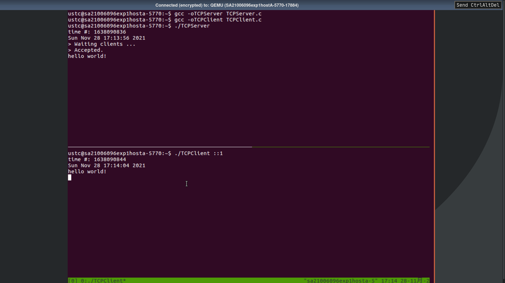
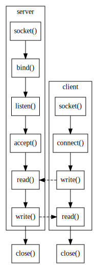
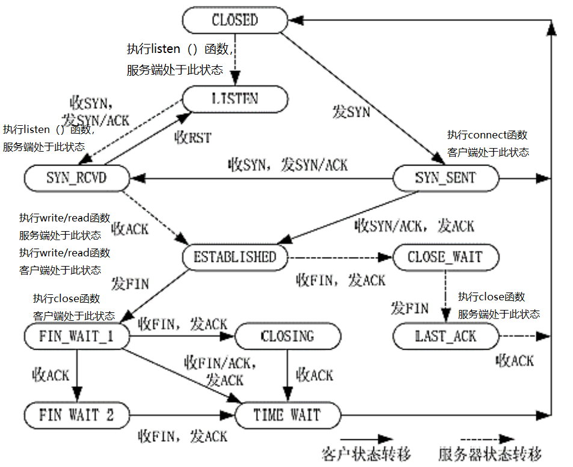

## 实验原理

```{.c}
// 获取当前时间秒数
time_t t0 = time(NULL)；

// socket 函数打开 socket 文件，返回一个描述符 sockfd ，唯一标识一个 socket
if((sockfd = socket(AF_INET6, SOCK_STREAM, 0)) < 0)

// 建立一个连接，在发送数据的时候在数据包中做一个标记，表明是那个编辑框发送的。
// AF_INET6 表示用 ipv6 地址。
servaddr.sin6_family = AF_INET6;

// 设置端口为 20000。
servaddr.sin6_port = htons(20000);

// 清零结构体
bzero(&servaddr, sizeof(servaddr));

// 把一个地址族中的特定地址赋给 socket，
// 包含三个参数： sockfd 描述符、要绑定给 sockfd 的协议地址、对应地址长度。
if(bind(sockfd, (struct sockaddr*)&servaddr, sizeof(servaddr)) == -1)

// 服务器用于监听 socket 的函数
// 在监听过程中如果客户端发出了连接请求，服务器端就能够接收到这个请求。
if(listen(sockfd, 5) == -1)
while(TRUE) {
    printf("> Waiting clients ...\r\n");
    // 获取 socket 地址的长度。
    socklen_t clilen = sizeof(struct sockaddr);
    // 服务器端调用此函数来接受连接请求，之后就可以开始网络 I/O 操作
    fd = accept(sockfd, (struct sockaddr*)&cliaddr, &clilen);

// 如果 fd == -1，则说明连接请求失败。
if(fd == -1) {
    perror("accept error");
}
printf("> Accepted.\r\n");

// read 函数让客户端与服务器端实现收发数据。
while((n = read(fd, line, MAXLINE)) > 0) {
    //接受请求以后进行读操作。
    line[n] = 0;
    // fputs 是将标准输出内容写入 line 中。
    if(fputs(line, stdout) == EOF)
        perror("fputs error");

// 客户端通过调用此函数来建立与服务器的连接
// 它有三个参数分别是客户端的 socket
// 描述字、服务器的 socket 地址、socket 地址的长度。
// 客户端与服务端的代码大致相同，区别大致是客户端负责发起连接
// 客户端负责接受连接，并接受来自客户端的数据并显示出来，而这个过程双方不可调换。
if(connect(sockfd, (struct sockaddr*)&servaddr, sizeof(servaddr)) < 0)
```

## 实验结果

### 1

阅读本文档中的两个程序 TCPClient.c、 TCPServer.c；

### 2

编译与运行程序：

1. 新建文件 TCPClient.c、 TCPServer.c，参考文档中的示例编写程序。
2. 在保存代码文件的文件夹中打开两个终端。
3. 首先编译并运行服务器：
  1. 执行 `gcc TCPSever.c –o TCPServer`{.sh} 编译服务器程序。
  2. 执行命令`./TCPServr`{.sh} 运行服务器程序。
4. 其次编译并运行客户端：
  1. 执行 `gcc TCPClient.c –o TCPClient`{.sh} 编译客户端程序。
  2. 执行`./TCPClient ::1`{.sh} 运行客户端程序。

---

分别对服务端和客户端代码进行编译，分别运行服务端和客户端代码，并进行数据的收发，
运行程序后，通过客户端向服务端发送消息，服务端可以成功接收。结果如图 [2](#fig:2)。

{#fig:2}

## 思考题

### 4

上述示例程序是一个基于 C/S 模型的 TCP 通信程序。请根据对示例程序的理解将
socket()、 write()、 close()、 read()、 listen()、 bind()、connect()、 accept()
这八个基本函数填入以下这个典型 C/S 模型 TCP 通信程序流程图中。

---

{#fig:4}

如图 [4](#fig:4)。

### 5

下面给出了一张 TCP 状态转移图。请根据你的理解将执行上题中每个函数之后 TCP 连
接所处的状态在图中标出，标识的方式是在状态旁写出 (主机 A/主机 B 执行函数名，主机
A/主机 B 处于此状态)。根据这个状态转移图的理解以及相关资料简要说明 SYN Flood 攻
击的实现原理。

---

{#fig:5}

如图 [5](#fig:5)。SYN Flood 攻击的实现原理是一个用户向服务器发送了 SYN 报文后突
然死机或掉线，那么服务器在发出 SYN+ACK 应答报文后是无法收到客户端的 ACK 报文的
(第三次握手无法完成)，这种情况下服务器端一般会重试(再次发送 SYN+ACK 给客户端)并
等待一段时间后丢弃这个未完成的连接，这段时间的长度称为 SYN Timeout，一般来说这
个时间是分钟的数量级(大约为 30 秒-2 分钟)，如果有大量的等待丢失的情况发生，服务
器端将为了维护一个非常大的半连接请求而消耗非常多的资源，服务器的负载将会变得非
常巨大，最后服务器疲于处理攻击者伪造的 TCP 连接请求而无暇理睬客户的正常请求。

## 实验收获

通过本次实验，我通过对 TCP 客户端和服务端分别进行编程，深刻理解了 TCP 收发数据
的流程和步骤。同时，我了解到 SYN flood 攻击是一个常见且难以解决的问题，值得进一
步思考。
