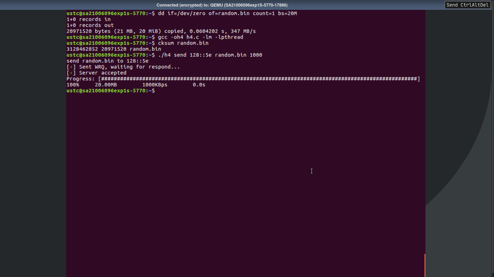

## 实验题目

要求编写一个程序,将一个不小于 20M 的文件(不一定是文本文件)从一个主机发送到另外
一个主机，通信需要在 IPv6 环境下完成 (即这两个主机均使用 IPv6 地址)。

- 基本要求
  - 此程序不需要有图形界面,即图形界面不作为评分依据。
  - 主机 B 收到的由主机 A 发来的文件必须与主机 A 上的文件一致,即发送前后文件的
  校验值 (CRC32) 相同。
  - 需要可以控制文件传输的速度 （即在程序开始运行时询问用户以多大的速度发送文件，
  而后一直以给定的速率传输)。
  - 要求在文件发送开始前接收主机可以选择拒绝或者同意接收文件。
- 扩展要求(完成此要求者加分。)
  - 要求在文件发送过程中两个主机都能看到传输的进度，即已传大小、百分比、文件传
  输速度、预计传输时间等信息
  - 要求在文件发送过程中接收主机可以选择暂停、继续、终止接收文件。

## 实验原理

### 数据包格式

本程序借用了 tftp 的数据包结构，共有四种：

- write request
- data message
- ack message
- error message。

涉及到的RFC有：

- RFC1350：THE TFTP PROTOCOL (REVISION 2)
- RFC2349：TFTP Timeout Interval and Transfer Size Options

数据包的 opcode 定义如下：

- 2: Write request (WRQ)
- 3: Data (DATA)
- 4: Acknowledgment (ACK)
- 5: Error (ERROR)

write request格式为 opcode, filename, ' ', size, ' ', block

根据 tftp 协议，文件将按 512Byte 切成 block ，每一个 data message 携带一个
block 的编号与数据。 data message 格式为 opcode, block, ' ', data。ack message
格式为 opcode, block。error message 格式为 opcode, errorcode。

其中，考虑到实验需求，使用 error code = 8/9/0 来暂停/继续/终止文件传输，具体定义
如下：

- 8: 暂停传输
- 9: 继续传输
- 0: 终止传输

### 传输协议

为了方便使用，这个程序没有区分客户端与服务端。发送方与接收方是同等的，称为Peer。
文件传输的时序图如图 [seq](#fig:seq)。

{#fig:seq}

### 命令行参数

```sh
./h4 send <ip>[<:port>] <filename> [<speedlimit/KBps>]
./h4 recv [<port>]
```

第一个线程负责处理用户输入的控制命令。第二个线程用来管理发送与接收文件操作。

- p: 暂停接受文件。
- r: 继续接受文件。
- q: 终止接受文件。

### 计算传输速度

在每次发送或接收到数据包的时候，每间隔50个数据包记录下时间戳。同时计算遇上个时
间戳之间的差值 interval 。有了 interval ，传输速度是很好计算的。为了使输出的传
输速度更稳定，这里对 interval 进行指数平滑。

### 控制传输速度

在每次发完数据包之后，记下当前时间和以该速率恒定发送时的理想时间，然后暂停直到
到达该理想时间，就发下一个数据包。

## 实验结果

### CRC校验

使用 `cksum`{.sh} 实现 CRC32 校验。由图 [1](#fig:1) 和 [2](#fig:2) 可知，传输前
后文件的 CRC32 相同。

{#fig:1}

{#fig:2}

### 速度控制与信息输出

由图 [1](#fig:1) 和 [2](#fig:2) 可知，传输速度可以指定，发送端与接收端都能看到
百分比、文件传输速度、预计传输时间等信息。

### 暂停/继续传输

{#fig:1p}

{#fig:2p}

{#fig:1r}

{#fig:2r}

{#fig:1q}

{#fig:2q}

- 暂停：图 [1p](#fig:1p) 和 [2p](#fig:2p)
- 继续：图 [1r](#fig:1r) 和 [2r](#fig:2r)
- 终止指令：图 [1q](#fig:1q) 和 [2q](#fig:2q)

## 实验收获

一些值得注意的地方：

- `gcc -lm -lpthread -oh4 h4.c`{.sh} 在实验的虚拟机上运行会失败，在我的 Linux
PC 上可以通过。`gcc -oh4 h4.c -lm -lpthread`{.sh} 都可以通过。我认为这是
这是 Ubuntu 14 的 `gcc`{.sh} 版本过低的缘故。
- `dd if=/dev/random of=random.bin bs=20M count=1`{.sh} 在我的 Linux PC 上可以
得到一个 20M 大小的文件，但在实验的虚拟机中只能得到大小随机但都不超过 1M 的文件。
个人猜测这是因为我的 Linux PC 使用的文件系统是 btrfs 而 Ubuntu 虚拟机上使用的是
ext4。

我学到了：

- IPv6 下两个主机之间的文件传输的原理
- 文件传输中控制其暂停、继续、终止的基本操作及其原理实现
- tftp 协议
