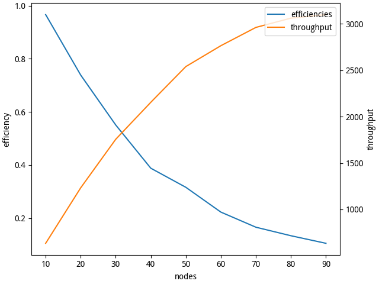
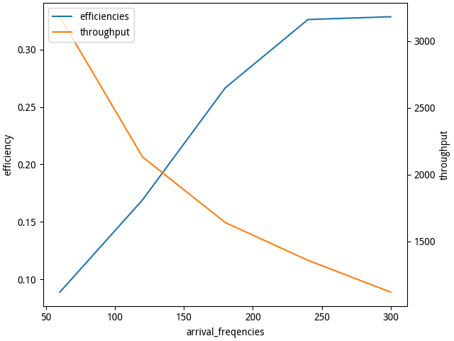
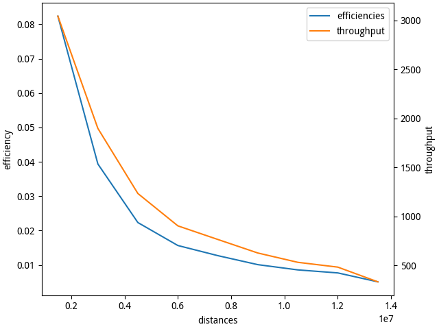

## Introduction

CSMA (Carrier Sense Multiple Access) is a MAC protocol for IEEE 802 protocols.
It can be divided into persistent and non-persistent.

- persistent:
  If the transmission medium is idle, CSMA will transmits immediately. If busy,
  it senses the transmission medium continuously until it becomes idle, then
  transmits the message with a probability.
- non-persistent:
  If the transmission medium is idle, CSMA will transmits immediately. If busy,
  it will wait a random time before repeating the whole logic cycle again.

According to the differences of probability, persistent CSMA can be divided
into 1-persistent and $p$-persistent, where $0 < p < 1$.

CSMA has some varieties:

- CSMA/CD (Collision Detection, used by Ethernet):
  If the transmission medium is idle, CSMA will transmits immediately. If busy,
  it senses the transmission medium continuously until it becomes idle, then
  transmits the message. If a collision is detected, terminate the
  transmission.
- CSMA/CA (Collision Avoidance, used by WLAN):
  If the transmission medium is idle, CSMA will transmits immediately. If busy,
  it will wait a random number of slots before repeating the whole logic cycle
  again.
- CSMA/CR (Collision Resolution, used by CAN):
  If the transmission medium is idle, CSMA will transmits immediately. If busy,
  it will use a priority to avoid collision.

Note that WLAN don't use CSMA/CD because of WLAN is usually half-duplex not
full-duplex, which make it cannot detect the collision while sending a message.
WLAN's transmission medium is not optical fiber but air, which results in it is
expensive to realize receive/transmit isolation to suppress self-interrupt,
MIMO is cheaper to increase the transmission ratio than receive/transmit
isolation. So WLAN selects CSMA/CA.

## Simulation

### Package Arriving Time

For each node, the arriving time of a package obeys Poisson distribution.
i.e., the interval of arriving time $T$ obeys exponential distribution.

$$f_T(t) = A\exp(-At), t > 0$$

Where, $f_T$ is probability density function of a random variable $T$. $A$ is
average time of arrival.

Because for any random variable $X$ and $Y = g(X)$, we have

$$\begin{aligned}
  \mathrm{d}F_Y(y) & = \mathrm{d}F_X(x) \\
  f_Y(y)\mathrm{d}y & = f_X(x)\mathrm{d}x
\end{aligned}$$

Where, $F_X$ is the cumulative distribution function of a random variable $X$.
So, For a random variable $X$,

$$\begin{aligned}
  f_{X}(x) & = 1, 0 < x < 1\\
  Y & = -\frac1A\ln(1 - x)
\end{aligned}$$

$Y$ will obey exponential distribution. We can use this method to get random
variables obeying exponential distribution.

### Package Length

In order to avoid a node occupying bus for a long time, We regulate the maximum
of a packet length is 1500.

### Metrics

We use the following metrics to evaluate our net:

- Throughput:
  Number of successful transmissions.
- Efficiency:
  ratio of number of successful transmissions and total number of
  transmissions. It must $\leqslant 1$.
  
### Algorithm

We initialize $N$ nodes, which adjacent distance is $D$. Each node has a queue
containing some packets, which time of arrival are random and obeys Poisson
distribution. The packet whose time of arrival is minimal will be transmitted.
If another node has a arriving packets when the packet whose time of arrival
is minimal is transmitted to this node, a collision will occur.

### Analysis

We can change some arguments of simulation program.

```shell
$ ./main.py --help
CSMA/CD Algorithm.

usage: main.py [-hVn] [-t <time>] [-o <dir>]

options:
    -h, --help                  Show this screen.
    -V, --version               Show version.
    -t, --time <time>           Simulation time, unit: s. [default: 3600]
    -o, --output <dir>          Save output to a directory.
    -n, --dry-run               Don't open any window.
$ ./main.py
```

Analyze the result of simulation, we can found:







- More nodes, lower efficiency.
- Higher average arriving freqency, lower efficiency.
- Longer distance, lower efficiency.
- Except distance, both number of node and average time of arrival will
increase throughput.

These facts are consistent with the common sense.
